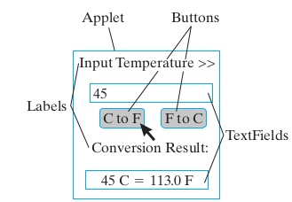

***5.0*** Design a program that performs temperature conversions from Fahrenheit to Celsius and vice versa. This problem requires two classes, a `Temperature class` and a `TemperatureUI class`. The Temperature class will perform the temperature conversions, and TemperatureUI will serve as the user interface. The Temperature class should contain `2 static methods`, one for each conversion. Implement the TemperatureUI class and use it to test the methods in Temperature class. Its run() method should use an **input-process-output** algorithm:  
*Prompt the user for input, perform the necessary processing, and output the result*.  
**Note** that because Temperature’s conversion methods are class methods, you do not need to instantiate a Temperature object in this project. You can invoke the conversion methods directly through the Temperature class:  
`double fahr = Temperature.celsToFahr(98.6);`

***5.1*** Design and implement a GUI to use for testing the Temperature class. The GUI should have the layout shown in the figure below.

EXERCISE 5.7 A Certificate of Deposit (CD) is an investment instru-
ment that accumulates interest at a given rate for an initial principal over
a fixed number of years. The formula for compounding interest is shown
in Table 5.11. It assumes that interest is compounded annually. For daily
compounding, the annual rate must be divided by 365, and the com-
pounding period must be multiplied by 365, giving: a = p(1 + r/365) 365n .
Implement a BankCD class that calculates the maturity value of a CD. Fig-
ure 5.11 gives the design of the class. It should have three instance vari-
ables for the CD’s principal, rate, and years. Its constructor method sets
the initial values of these variables when a BankCD is instantiated. Its
two public methods calculate the maturity value using yearly and daily
Figure 5.11: The BankCD class.SECTION 5.7 •
Character Data and Operators
231
compounding interest, respectively. Use the Math.pow() method to cal-
culate maturity values. For example, the following expression calculates
maturity value with annual compounding:

p r i n c i p a l ∗ Math . pow( 1 + r a t e , y e a r s )
TABLE 5.12 Formula for calculating compound interest
a = p(1 + r) n where
•
•
•
•
a is the CD’s value at the end of the nth year
p is the principal or original investment amount
r is the annual interest rate
n is the number of years or the compounding period
EXERCISE 5.8 Design a command-line user interface to the BankCD
class that lets the user input principal, interest rate, and years, and re-
ports the CD’s maturity value with both yearly and daily compounding.
Use NumberFormat objects to display percentages and dollar figures in
an appropriate format. The program’s output should look something like
the following (user’s inputs are in cyan):
************************ OUTPUT ********************
Compare daily and annual compounding for a Bank CD.
Input CD initial principal, e.g. 1000.55 > 2500
Input CD interest rate, e.g. 6.5 > 7.8
Input the number of years to maturity, e.g., 10.5 > 5
For Principal = $2,500.00 Rate= 7.8% Years= 5.0
The maturity value compounded yearly is $3,639.43
The maturity value compounded daily is: $3,692.30
************************ OUTPUT ********************